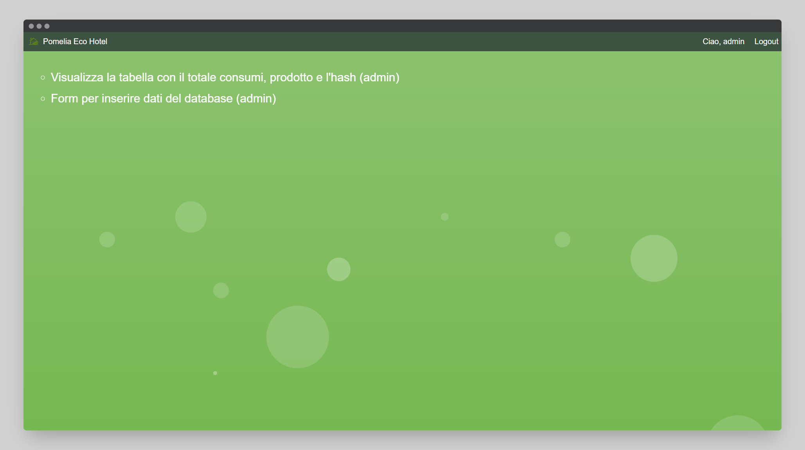
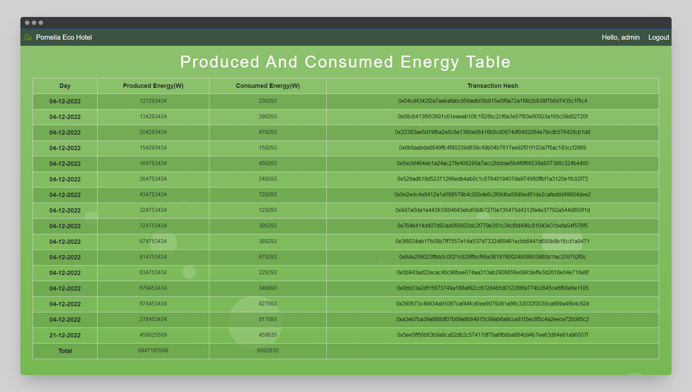
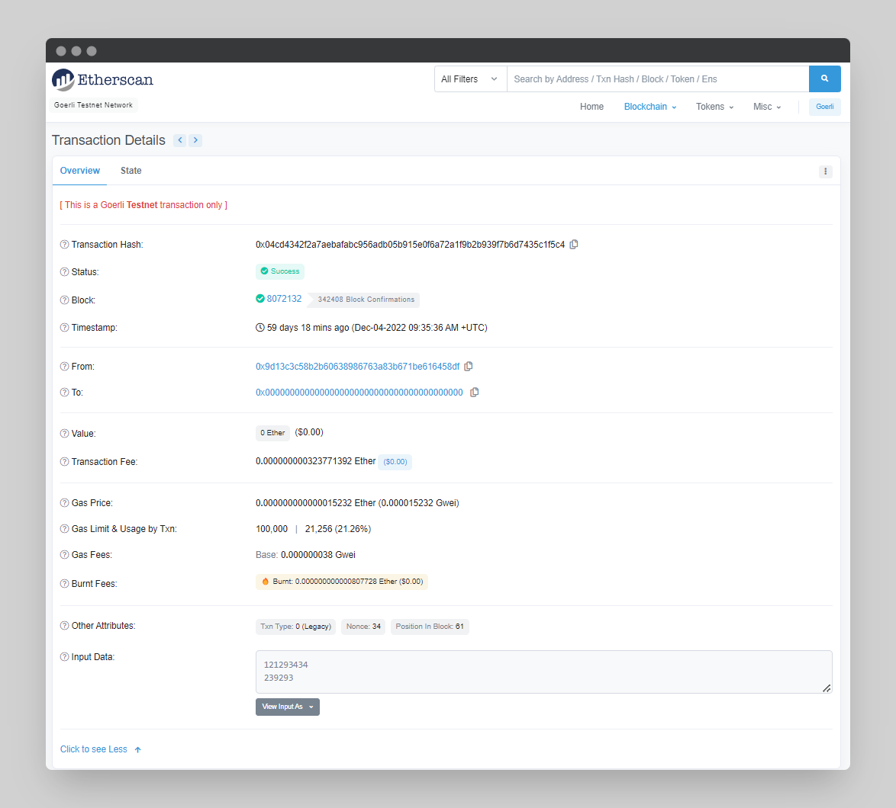
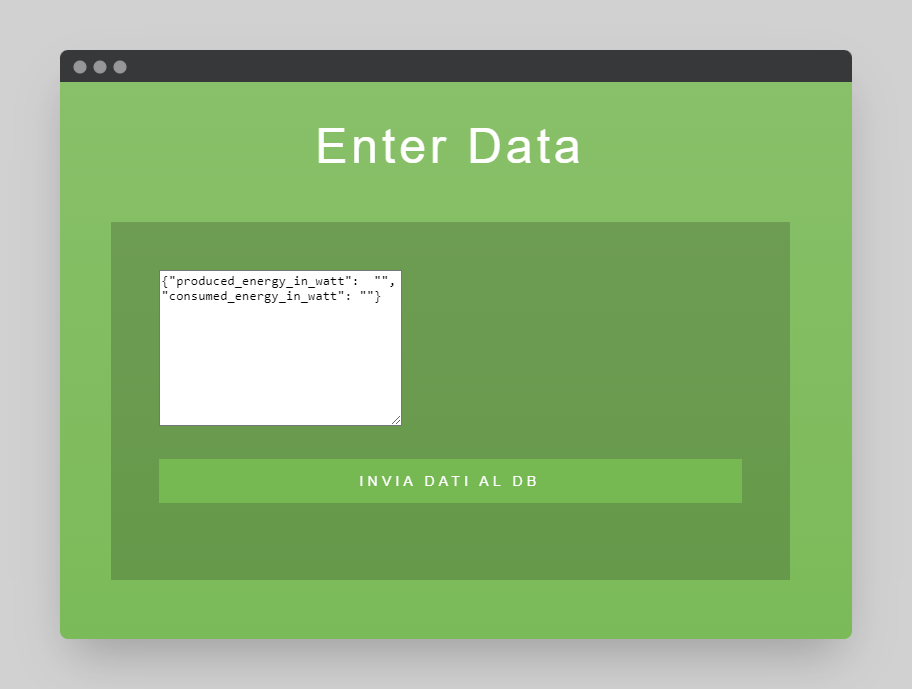

<h1 align="center">
    EcoHotel
</h1>

<br/>

This repo shows how to create a blockchain-based tracking system of consumption and energy produced by photovoltaic panels via a web application.

This system shall receive, at a specified endpoint, POST requests in JSON in the following format: 

    {
        ‘produced_energy_in_watt’: 121293434,
        ‘consumed_energy_in_watt’: 239293
    }
    
These requests will then be displayed in table form in the web application and a transaction will be made on Ethereum Goerli containing the two values.

<hr/>

## 🛠️&nbsp; How to run
- Clone the repo
- Create and activate virtual enviroment
- Install requirements: --> 
    ```
    pip install -r requirements.txt
    ```
- Make database migrations: --> 
    ```
    python manage.py makemigrations
    ``` 
    ```
    python manage.py migrate
    ```
- Run server: --> 
    ```
    python manage.py runserver
    ```
- Open [http://127.0.0.1:8000/](http://127.0.0.1:8000/) in your browser
- Log in with the following credentials to access all features: 

    Username: `admin`
    
    password: `admin`

## 🗎&nbsp; Requirements
- Main page, accessible only by logged in users, where to show the table containing the values in question and the hash of the transaction.

- A page, to which only administrators can access, where it is possible to see the total consumed and produced.

- A logging system to memorize the last IP that accessed the platform for a certain administrator user, in order to show a warning message when this is different from      the previous one.

## 🚀&nbsp; How it's suppose to work?
Once logged in with the admin user you are on this page:

<p align="center">
    
</p>

### Produced And Consumed Energy Table
If we enter the first link we can see the table with the relative data of energy produced and energy consumed:

<p align="center">
    
</p>

This data is extracted from an SQL database which is populated when a transaction is sent to the Goerli blockchain.

By clicking on the hash of the transaction, you are redirected to Goerli's Etherscan where you can see all the details of the transaction.

<p align="center">
    
</p>

### Form to enter database data
If we enter the second link we access the form to enter data into the database:

<p align="center">
    
</p>

By sending the data, a transaction will be sent on the Goerli blockchain and will be shown in the table in the previous link.

## 🏴‍☠️&nbsp; Add ons

There is an implementation to check if the login ip address is always the same or not for the admin user.

## 💭&nbsp; My thoughts

As a crypto and blockchain enthusiast it was very satisfying and useful to get my hands on transactions in the blockchain.

However, in this project the Infura API keys and the private key of the wallet are exposed and it's not good at all for security, but being my first project I didn't know how to do it. Now, after several other projects, I know how to do it and maybe in the future I will upgrade.

## 📫&nbsp; Have a question? Want to chat? 

[LinkedIn](https://www.linkedin.com/in/daniele-menin/)

[Instagram](https://www.instagram.com/danielemeno96/)

